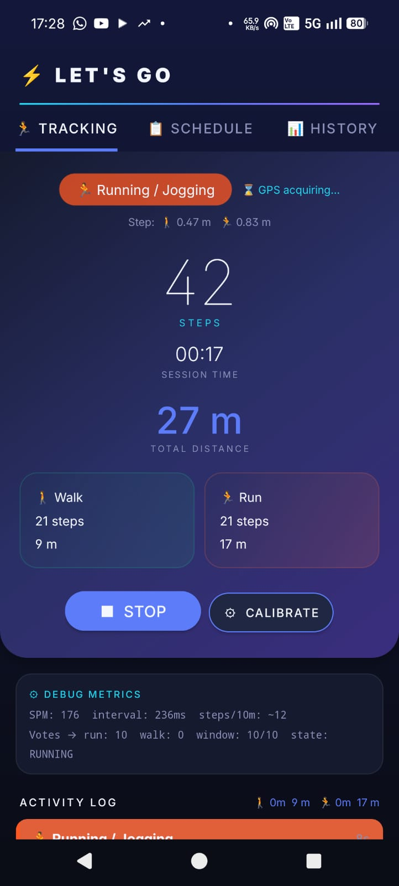
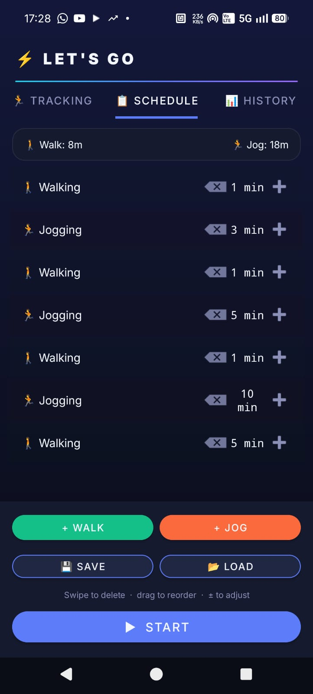
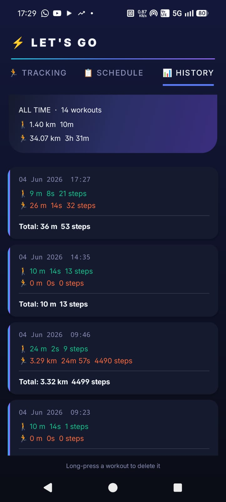
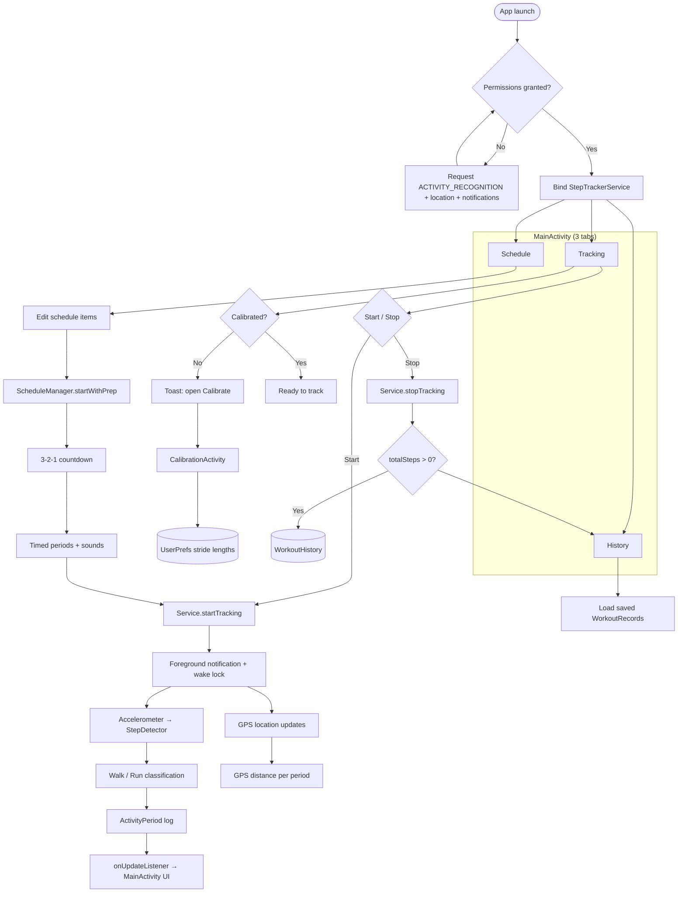
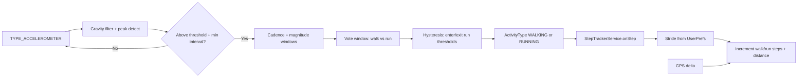
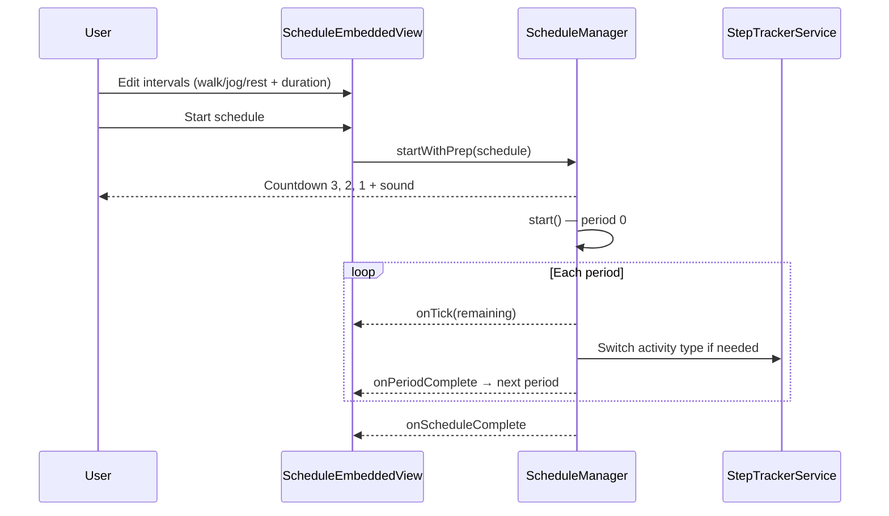

# Step Tracker ("Let's GO")

Android app for live step counting, walk/run classification, GPS distance, interval workout schedules, and session history.

**Repository:** https://github.com/avishayal-source/Step-tracker.git

## Screenshots

| Tracking | Schedule | History |
|:--------:|:--------:|:-------:|
|  |  |  |

## Features

| Area | What it does |
|------|----------------|
| **Live tracking** | Foreground service counts steps from the accelerometer and classifies each step as walk or run (cadence + magnitude with hysteresis). |
| **Distance** | Uses calibrated stride length per activity; GPS augments distance when location permission is granted. |
| **Calibration** | Wizard measures walk/jog stride length (sensor + optional GPS) and stores values in `UserPrefs`. |
| **Schedules** | Build timed intervals (walk/jog/rest); 3-2-1 prep countdown, period timers, audio cues, persistence across rotation. |
| **History** | Completed sessions saved to `WorkoutHistory` (steps, distance, duration per activity type). |

## Requirements

- Android **8.0+** (API 26), target SDK 34
- Device with **accelerometer** (required)
- Optional: step counter hardware, GPS for distance calibration and tracking

### Permissions

- `ACTIVITY_RECOGNITION` — step tracking (Android 10+)
- `ACCESS_FINE_LOCATION` / `ACCESS_COARSE_LOCATION` — GPS distance (optional but recommended)
- `POST_NOTIFICATIONS` — foreground tracking notification (Android 13+)
- Foreground service types: `health`, `location`

## Build and run

```bash
cd StepTracker
./gradlew assembleDebug
```

Install the APK from `app/build/outputs/apk/debug/`, or open the project in Android Studio and run on a device/emulator with an accelerometer.

## Project structure

```
app/src/main/java/com/steptracker/app/
├── MainActivity.kt           # Tabs: Tracking | Schedule | History
├── StepTrackerService.kt     # Foreground tracking, GPS, session state
├── StepDetector.kt           # Accelerometer step + walk/run classifier
├── CalibrationActivity.kt    # Stride calibration wizard
├── ScheduleManager.kt        # Interval timer engine
├── ScheduleEmbeddedView.kt   # Schedule UI in main tab
├── UserPrefs.kt              # Stride lengths, calibration flags
└── WorkoutHistory.kt         # Persisted workout records
```

## Architecture flow

High-level path from app launch through tracking and history.



## Step detection flow

How a single accelerometer sample becomes a classified step and distance update.



## Schedule flow



## Data persistence

| Store | Contents |
|-------|----------|
| `UserPrefs` | Walk/jog stride (m), calibration flag |
| `ScheduleStore` / `SavedSchedule` | Named schedule templates |
| `ScheduleRunPersistence` | In-progress schedule snapshot (resume after recreate) |
| `WorkoutHistory` | Past sessions: steps, distance, duration by activity |

## License

Add a license file if you plan to open-source the project publicly.
